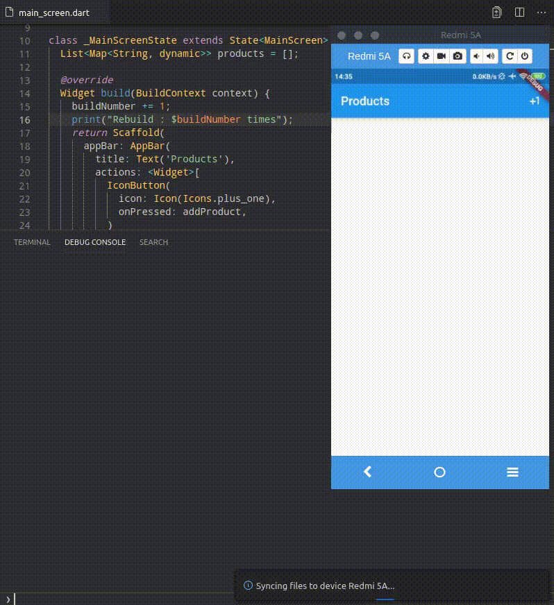

# Interactive List and SQLite storage

Firstly, we are going to discuss its simplified implementation. At the MainScreen,
we won't connect it to SQLite. But later on, We can discuss more complex 
implementation by calling SQLite queries.

### Should we use FutureBuilder ?

In many tutorials spread accross internet, app screen can shows Loading indicator, and later on, it shows ListView and its ListTile **after fetching to Database.**

It works well if **_there are no further interaction_** with ListView later on.

As we using future, the builder will only **triggered twice**.


``` dart
class MainScreen extends StatelessWidget {
  @override
  Widget build(BuildContext context) {
    return Container(
      child: FutureBuilder(
        future: queryDatabase(), // Calling Database
        builder: (context, snapshot) {
          if (snapshot.hasData) { // After Callback, it may triggers this Part
            return ListView.builder(
              itemBuilder: (_, index) {
                return ListTile(
                  title: Text("$index"),
                );
              },
            );
          }
          return Center( // First Triggering this Part
            child: CircularProgressIndicator(),
          );
        },
      ),
    );
  }
}
```


### The solution is Stateful Widget !

By using Stateful Widget, we can store our products, in variable. Therefore, 
each time MainScreen's build method called, the app will display updated List.

``` dart
class MainScreen extends StatefulWidget {
  @override
  _MainScreenState createState() => _MainScreenState();
}

class _MainScreenState extends State<MainScreen> {
  List<Map<String, dynamic>> products = []; // Store Item, Here

  @override
  Widget build(BuildContext context) {
    return Scaffold(
      appBar: AppBar(...),
      body: Container(
        child: renderProducts(), // Render stored Item, here
      ),
    );
  }

```

We can see at the demo below, as we interact with buttons, the build method
always being re-called, and **fortunately, we can have our Expected Screen**


**Simple List Interaction**




#### Stack Overflow : Problem Description

> My goal is restoring data from sql database to Listview. Firstly, I started with creating database and model class. Secondly I realized that I have to use FutureBuilder. But I can't understood, how to use this stuff in my case. In addition I have known, that have to use GlobalKey.

``` dart
class _ListItem extends State<ListItem>  {
  String typeOfMuscle;
  String numberOfMuscle;
  TextEditingController customcintroller;
  ...

  AlertDialog(
    title: Text(name[indexAl]),
    content: TextFormField(
      controller: customcintroller,
      onSaved: (val) => this.numberOfMuscle = val,
    ),
  );
),
```


#### Stack Overflow : Answer

the problem is, in `onSaved` method, the app will only update local variable that
resides on each of `ListItem`. Therefore, the app does not know that new value 
should be displayed.

**How to make the widget `rerenders` ?** 

By using `setState((){})` as the code below

``` dart
class _ListItem extends State<ListItem>  {
  String typeOfMuscle;
  String numberOfMuscle;
  TextEditingController customcintroller;
  ...

  void updateAndRerender(val){
    this.numberOfMuscle = val;
    setState((){});
  }

  AlertDialog(
    title: Text(name[indexAl]),
    content: TextFormField(
      controller: customcintroller,
      onSaved: (val) {
        updateAndRerender(val);
      },
    ),
  );
),
```
